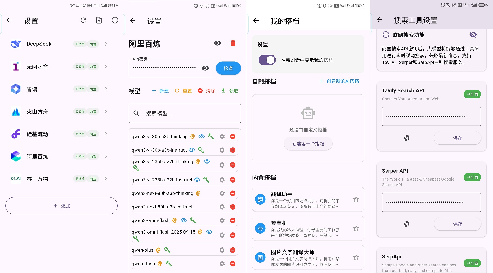
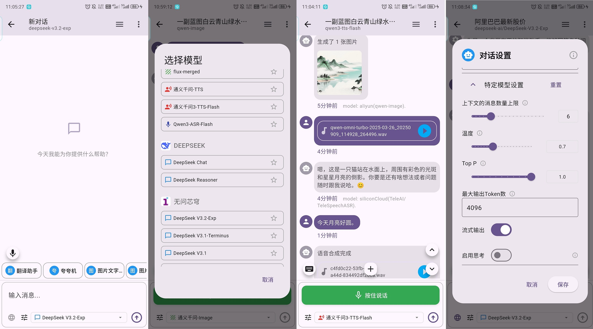

# Changelog

一些较大变更、新功能、bug 修复等记录放在此处，仅做参看的提交更新.

## 0.1.4-beta.1

- feat:
  - 全新的统一对话功能模块(页面有参考 chatbox 的安卓 App)
    - 支持部分对话、图片生成、语音合成、语音文件识别的大模型在同一个聊天页面可用
    - 内置平台支持部分最新版本的对话完成、图像生成、语音识别、语音合成模型
      - 支持阿里百炼、智谱、硅基流动、火山引擎部分模型
        - 这些模型内置，可手动添加一些较新的，都需要自行输入 API Key
      - 支持手动添加兼容 OpenAI API 结构的平台(比如 OpenRouter 等)，但仅支持对话完成的模型
    - 非阿里百炼、智谱平台，但支持工具调用的大模型，依旧可以使用 tools 来实现联网搜索功能
      - 阿里百炼部分模型、智谱平台自带有联网搜索功能(限时免费或需要付费)
      - 联网的工具调用支持 [serper](https://serper.dev/)、[tavily](https://www.tavily.com/)、[serpapi](https://serpapi.com/) 3 个平台
        - 需要至少配置上述搜索平台中任意一个的 API Key 才能使用工具调用功能
      - 部分平台模型+工具调用效果不佳
    - 实时语音输入使用阿里百炼的`paraformer-realtime-v2`模型(也需要配置 API Key 才能用)
    - 全新单独的 AI 聊天数据库设计(使用 sqlite 代替 objectbox，不支持分支对话了)
  - 添加了自定义的 dio 请求、响应日志拦截器，便于调试
- fix:
  - 修正了一些错误和调整了一些细节

注意：

可在移动版对话页面右上角新版本按钮体验新的统一对话功能模块。桌面端可用，但页面没适配。

新版统一聊天移动端截图如下:



- 在移动端旧版本对话主页面右上角，点击新版本悬浮按钮进入新对话主页
- 默认没有大模型可用，需要进入平台管理页面进行添加和配置
  - 可以加载使用内置的平台模型，都需要添加指定平台的 API Key
  - 对话模型可以在详情页的“获取”按钮获取，并简单点击添加
- 可以设置一些系统提示词(即我的搭档)，选择指定搭档，在对话时会先加载搭档的系统提示词
- 部分平台可以通过工具调用参数(tools)进行联网搜索功能
  - 需要配置 serper、tavily、serpapi 3 个平台中至少一个的 API Key



- 新建普通对话完成(cc)类型的模型对话，会显示部分“我的搭档”
  - 可以自行使用一些良好的系统提示词，提高工作效率
- 点击模型下拉框可以选择更多平台的模型(需要平台有对应的 API Key)
- 直接文生图(t2i)、图生图(i2i)、语音文件识别(asr)、语音合成(tts)等各种类型的大模型
  - 图片生成 API 不支持多轮对话，所以后续调用会把之前对话的所有用户输入文本作为新的绘画提示词
    - 不需要就用户输入的，则新开对话绘制图片
  - 语音文件识别、语音合成只会使用最后一个用户输入的文件或文本
    - 所以对话记录只会保存最后一个使用的模型信息，但对话消息列表可能有多种模型的响应内容
- 可以点击输入框上方的输入方式按钮切换手动输入或实时语音输入
  - 和旧版本不同，不会保留语音文件，直接使用`paraformer-realtime-v2`识别后的文本
- 普通对话、图片生成、语音文件识别、语音合成等可能根据不同平台模型，有少许高级设置
  - 可在对应设置弹窗中设定

## 0.1.3-beta.1

- feat:
  - 添加使用阿里百炼平台 qwen 系列模型 API 的“快速翻译”功能模块
  - 集成了很多基于官方、开源、第三方的 API 构建的生活娱乐功能：
    - 各种新闻热榜，杂文趣图；
    - 使用官方(或开源)提供的 API 构建的服务：
      - [Bangumi](https://github.com/bangumi/api)、[MyALimeList](https://docs.api.jikan.moe/)、[TMDB](https://developer.themoviedb.org/reference/intro/getting-started)、[USDA 食品数据中心](https://fdc.nal.usda.gov/api-guide/) 等；
    - 使用第三方提供的 API 构建的服务：
      - 豆果美食、岛读 APP、`ONE·一个` APP
      - 好看漫画(默认未启用，需要自行取消注释后编译)
- refactor:
  - 尽量将各个模块的 `presentation` 中的文件夹/文件/类名命名方式统一(data/暂不处理)：
    - 类似:有前置文件夹的，文件名不重复，但类名要完整。
    - `xxx/presentation/pages/one/home_page.dart` -> `OneHomePage`
    - `xxx/presentation/widgets/one/content_card.dart` -> `OneContentCard`
- fix:
  - 修正了一些错误和调整了一些细节

## 0.1.2-beta.1

- chore:
  - 更新开发环境到 flutter 3.32.4，以及更新相关依赖到最新
- feat:
  - 添加了简单的个人信息管理
  - 添加了简单的“训练助手”功能模块
  - 添加了简单的“饮食日记”功能模块
  - 添加了简单的“极简记账”功能模块
  - 添加了简单的“记事本”功能模块
- refactor:
  - 重构了更多功能入口和更多功能页面
  - 移动端对话历史记录从抽屉改为单独页面
- fix:
  - 移除了本地解析 doc 文件内容的功能(相关依赖库太老旧影响主流库版本更新)
  - 修正了一些错误和调整了一些细节

---

**2025-07-05**: 新增记事本功能

**2025-07-02**: 新增极简记账功能

**2025-06-23**: 新增简单的训练助手、饮食日记功能

- 饮食日记支持自定义食品 json 文件导入，可参考我之前将《中国食物成分表标准版(第 6 版)》中“能量和食物一般营养成分”部分的表格截图转换为特定格式的测试 json 文件 [Sanotsu/china-food-composition-data](https://github.com/Sanotsu/china-food-composition-data)。
- 注意，该仓库食品营养素 json 文件可以正常导入，但无法保证该 OCR 结果正确。

## 0.1.1-beta.1

- feat:
  - 添加更多功能：
    - 图片生成、视频生成、语音合成、录音文件识别
- refactor:
  - 重构了项目架构，更简化类似功能模块结构
  - 重构拆分了分支对话主页面大文件
  - 重构了分支对话的输入组件，分为上方输入下方功能按钮
  - 统一使用 audio_waveforms 来进行简单的移动平台的音频录制和本地播放
  - Android 原生代码简单实现 m4a 录音转为 pcm 格式，不再使用 ffmpeg_kit_flutter，减小 apk 体积
  - 重新规划了应用文件存放位置，**若要使用旧版数据，请手动移动数据库相关文件**，后续不会再改变文件夹结构了

具体文件和文件夹迁移：

- 打开文件管理器，进入 “SuChatFiles/”路径，桌面端在“文档/SuChatFiles/”中
- 新建加黑的层级文件夹并移动旧文件:
  - SuChatFiles/embedded_suchat.db -> SuChatFiles/**DB/sqlite_db**/embedded_suchat.db
  - SuChatFiles/embedded_suchat.db-journal -> SuChatFiles/**DB/sqlite_db**/embedded_suchat.db-journal
  - SuChatFiles/objectbox/ -> SuChatFiles/**DB**/objectbox/
- 启动应用(需确保杀掉进程后重新加载)

注意 1：

- 因为使用讯飞语音识别时，要把录音 m4a 转为 pcm 格式，因而使用了 [ffmpeg_kit_flutter](https://github.com/arthenica/ffmpeg-kit) 库
- 但这个库因为[一些原因](https://tanersener.medium.com/saying-goodbye-to-ffmpegkit-33ae939767e1)结束维护了，所以先改使用 [ffmpeg_kit_flutter_new](https://github.com/sk3llo/ffmpeg_kit_flutter)
- 但是，仅这一项改动，apk 的体积增加了很多
- 所以在 Android 端，实现原生简单的 acc 编码的 m4a 录音转 pcm 格式，参看 [AudioConverterPlugin.kt](android/app/src/main/kotlin/com/swm/suchat_lite/AudioConverterPlugin.kt)

```sh
# 0.1.0 旧版本使用的临时替代库
# ffmpeg_kit_flutter:
#   git:
#     url: https://github.com/MSOB7YY/ffmpeg-kit
#     path: flutter/flutter
#     ref: 1d29b16
Running Gradle task 'assembleRelease'...                          601.7s
✓ Built build/app/outputs/flutter-apk/app-armeabi-v7a-release.apk (31.8MB)
✓ Built build/app/outputs/flutter-apk/app-arm64-v8a-release.apk (31.9MB)
✓ Built build/app/outputs/flutter-apk/app-x86_64-release.apk (33.9MB)

# 0.1.1 使用ffmpeg_kit_flutter_new: ^1.6.1
Running Gradle task 'assembleRelease'...                          584.6s
✓ Built build/app/outputs/flutter-apk/app-armeabi-v7a-release.apk (51.1MB)
✓ Built build/app/outputs/flutter-apk/app-arm64-v8a-release.apk (36.9MB)
✓ Built build/app/outputs/flutter-apk/app-x86_64-release.apk (39.7MB)

# 简单原生实现 m4a 转 pcm，不使用任何ffmpeg_kit_flutter库
Running Gradle task 'assembleRelease'...                          527.6s
✓ Built build/app/outputs/flutter-apk/app-armeabi-v7a-release.apk (22.4MB)
✓ Built build/app/outputs/flutter-apk/app-arm64-v8a-release.apk (22.8MB)
✓ Built build/app/outputs/flutter-apk/app-x86_64-release.apk (23.8MB)
```

注意 2：

- 桌面端不再支持录音和音频播放(单纯图省事，audio_waveforms 不支持桌面端)
- 目前移动端可以录音的地方:
  - 对话主页的语音转文本输入
  - 声音复刻的语音录制
  - 语音识别的语音录制

---

**2025-05-28**：支持更多 AI 功能

- 点击对话记录侧边栏页面上下方更多功能按钮，即可进入更多功能页面，即可使用简单的录音识别、语音合成、图片生成、视频生成和其他扩展功能。

## 0.1.0-beta.1

首次打包版本，基本完成了 AI 聊天预想的所有功能。

- feat:
  - 调用在线云平台大模型 API 进行对话
    - 分支对话、角色扮演、各种简单的自定义、模型和 AK 管理、简单的备份恢复等。
