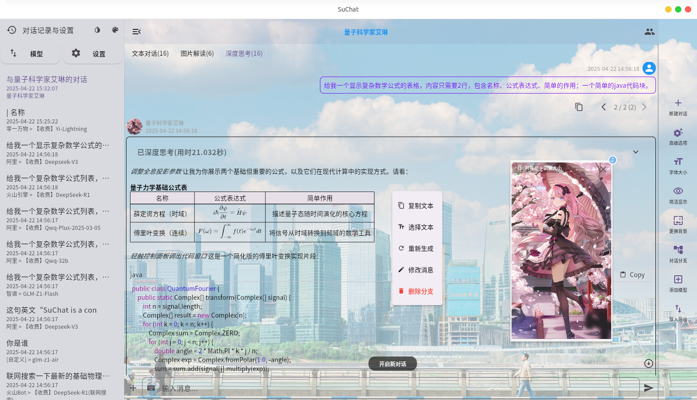

<p align="right">
  <a href="README-EN.md">English</a> |
  <a href="README.md">简体中文</a>
</p>

# SuChat Lite

SuChat is a concise AI chat application developed using Flutter, powered by calling cloud platform-based large model APIs online. It supports simple custom characters for role-playing.



## Features

- **Multi-LLM Provider Support**
  - Compatible with multiple cloud platform model HTTP APIs
  - Supports manual configuration for non-preset platforms: Just input the endpoint URL, model name, and API key
- **Local Data Storage**
  - All conversations are stored locally on the device (with separate records per platform)
- **Markdown, LaTeX & Code Highlighting**
  - Basic support for Markdown formatting, LaTeX equations, and Code highlighting
- **Enhanced Message Handling**
  - Edit/delete sent messages (branch management) via long-press (mobile) or right-click (desktop)
  - Adjustable message font size
  - Customizable text colors for: user input, AI "thinking" status, and responses
  - Customizable chat background images and sidebar colors
  - Compact message view option (hides avatars and action buttons)
- **Cross-Platform Compatibility**
  - Responsive design for both desktop and mobile (tested on Windows, Linux, and Android)
  - Ready-to-use installers with zero deployment requirements
- **Simple Custom Characters for Role-Playing**
  - Manage custom characters for role-playing scenarios
  - Customizable chat backgrounds for specific roles
  - Role-specific avatars displayed in bottom-left corner (click to zoom/drag)
- **And More**
  - Real-time streaming display of model responses
  - Advanced request parameter configuration per model (use with caution)
  - Data import/export (conversations, roles, model specs) – individual or bundled backups
  - Voice-to-text input on mobile (using iFlytek speech recognition API)

---

**Supported API providers** (as of 2025-04-18) must maintain HTTP API compatibility with OpenAI's structure:

- Chat Models:
  - [Alibaba Cloud](https://help.aliyun.com/zh/model-studio/developer-reference/compatibility-of-openai-with-dashscope)
  - [Baidu Wenxin](https://cloud.baidu.com/doc/WENXINWORKSHOP/s/Fm2vrveyu)
  - [Tencent Hunyuan](https://console.cloud.tencent.com/hunyuan/start)
  - [Zhipu AI](https://open.bigmodel.cn/dev/api/normal-model/glm-4)
  - [DeepSeek](https://api-docs.deepseek.com/zh-cn/)
  - [ByteDance Volcano](https://www.volcengine.com/docs/82379/1330310)
  - [01.AI](https://platform.lingyiwanwu.com/docs/api-reference)
  - [Infini-AI](https://docs.infini-ai.com/gen-studio/api/maas.html#/operations/chatCompletions)
  - [SiliconFlow](https://docs.siliconflow.cn/cn/api-reference/chat-completions/chat-completions)
- Custom platforms with OpenAI-compatible APIs can be added manually by specifying endpoints, model names, and API keys

**Tested Environments**:

- Ubuntu 22.04 (VirtualBox VM on Windows 7/i5-4460)
- Android 12/14 (Nubia Z60 Ultra/Xiaomi 6)
- Windows 11 (MECHREVO Glory 16 Pro)

---

If interested in [SiliconFlow](https://siliconflow.cn/zh-cn/models), consider using my referral code:  
[https://cloud.siliconflow.cn/i/tRIcST68](https://cloud.siliconflow.cn/i/tRIcST68)

## Quick Start

Download platform-specific installers from Releases. Desktop versions are portable (no installation required).

### Notes

Pre-built apps include basic models using my personal free-tier API keys. To upgrade:

1. Access configuration via sidebar "Models" → "Model Settings"
2. For advanced models, obtain keys from respective platforms
3. Manually add or import models/keys (see JSON specifications below)
   - **Keys are locally cached using `get_storage` – no network access except API calls**

---

<details>  
<summary>JSON Import Specifications</summary>

**Both API keys and model specs must be imported together for full functionality.**

#### API Key JSON Structure

Keys must match these exact field names:

```json
{
  "USER_ALIYUN_API_KEY": "sk-xxx",
  "USER_BAIDU_API_KEY_V2": "xxx",
  "USER_TENCENT_API_KEY": "xxx",

  "USER_DEEPSEEK_API_KEY": "sk-xxx",
  "USER_LINGYIWANWU_API_KEY": "xxx",
  "USER_ZHIPU_API_KEY": "xxx",

  "USER_SILICONCLOUD_API_KEY": "sk-xxx",
  "USER_INFINI_GEN_STUDIO_API_KEY": "sk-xxx",

  // Volcano Engine standard endpoint
  "USER_VOLCENGINE_API_KEY": "xxx",
  // Volcano Engine custom endpoint (for web-search apps)
  "USER_VOLCESBOT_API_KEY": "xxx",

  // xunfeiyun speech recognition
  "USER_XFYUN_APP_ID": "xxx",
  "USER_XFYUN_API_KEY": "xxx",
  "USER_XFYUN_API_SECRET": "xxx"
}
```

#### Model Specification JSON

Minimum required fields: **platform**, **model**, and **modelType**.

```json
[
  {
    "platform": "<platform enum value>",
    "model": "<exact model ID per API docs>",
    "modelType": "<model category enum>"
  },
  {
    "platform": "aliyun",
    "model": "deepseek-r1",
    "modelType": "reasoner"
  },
  {
    "platform": "aliyun",
    "model": "deepseek-v3",
    "modelType": "cc"
  }
  // ...
]
```

**Platform Enum Values**:

```ts
enum ApiPlatform {
  custom, // For non-preset platforms
  aliyun,
  baidu,
  tencent,
  deepseek,
  lingyiwanwu,
  zhipu,
  siliconCloud,
  infini,
  volcengine,
  volcesBot,
}
```

**ModelType Enum Values**:

```ts
enum LLModelType {
  cc, // Standard chat
  reasoner, // Advanced reasoning
  vision, // Image understanding
}
```

Pre-configured model specs are available in [/\_cus_model_jsons](./_cus_model_jsons).

</details>

## Project Structure

```sh
lib/
├── apis/                       # API modules
├── common/                     # Shared utilities
│   ├── components/             # UI components
│   ├── constants/              # Constants
│   ├── llm_spec/               # LLM specifications
│   └── utils/                  # Helper functions
├── models/                     # Data models
│   └── brief_ai_tools/         # AI-specific models
├── services/                   # Service layer
├── views/                      # UI layers
│   ├── brief_ai_assistant/     # AI views
│   │   ├── _chat_components/   # Chat widgets
│   │   ├── branch_chat/        # Main chat UI
│   │   └── model_config/       # Model settings
│   ├── home.dart               # Home screen
│   └── user_and_settings/      # User preferences
├── main.dart                   # Entry point
├── objectbox.g.dart            # Generated ORM code
└── objectbox-model.json        # Database schema
```

## Development Environment

Developed on Ubuntu 22.04 LTS (VirtualBox VM on Windows 7):

```sh
# Host specs:
$ lsb_release -c -a && uname -r -m
Distributor ID: Ubuntu
Description:    Ubuntu 22.04.3 LTS
Release:        22.04
Codename:       jammy
5.15.0-119-generic x86_64

# Toolchain versions (2025-04-21):
$ flutter --version
Flutter 3.29.2 • channel stable
Framework • revision c236373904 (5 weeks ago)
Engine • revision 18b71d647a
Tools • Dart 3.7.2 • DevTools 2.42.3
```

## Contribution

Issues and PRs are welcome for improvements.

---

—— Translated by DeepSeek
