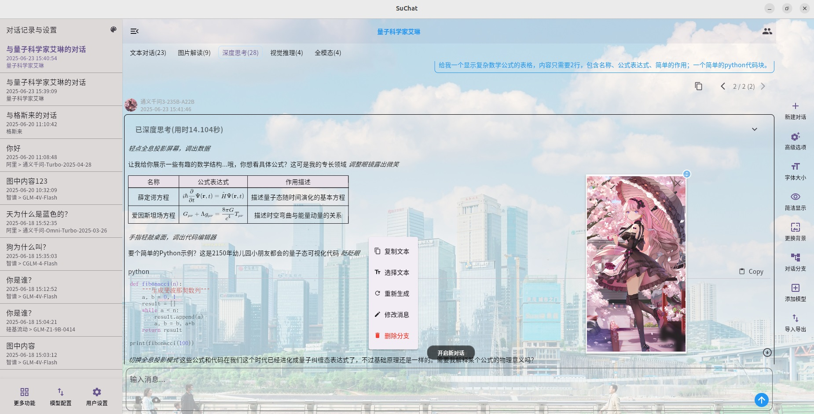
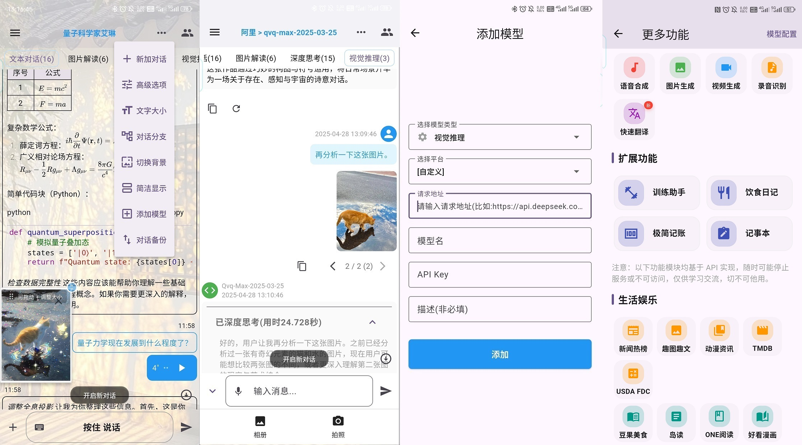
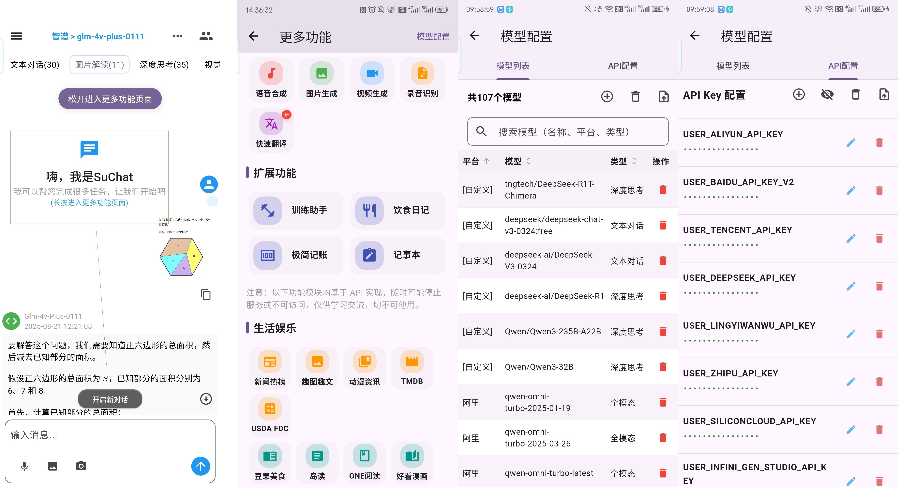
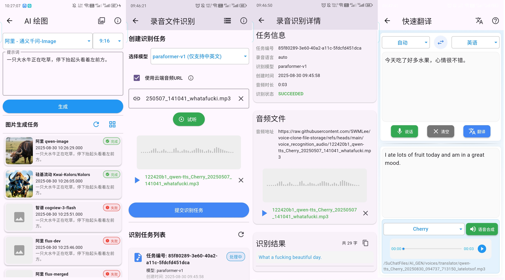
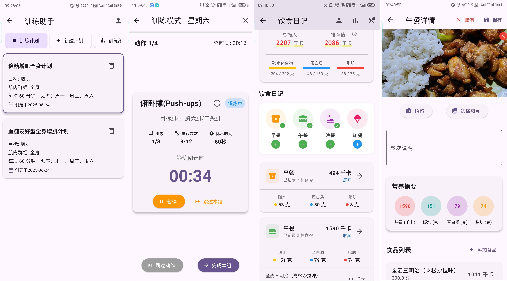
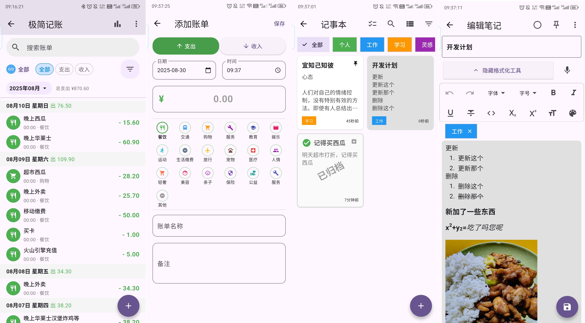
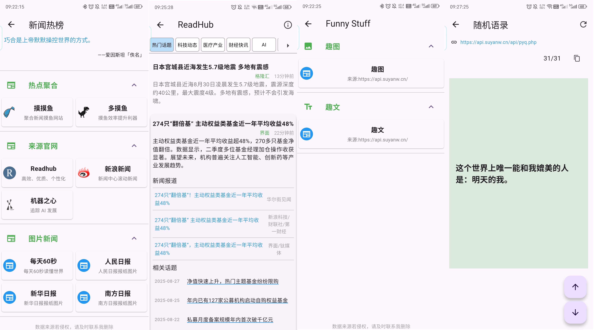
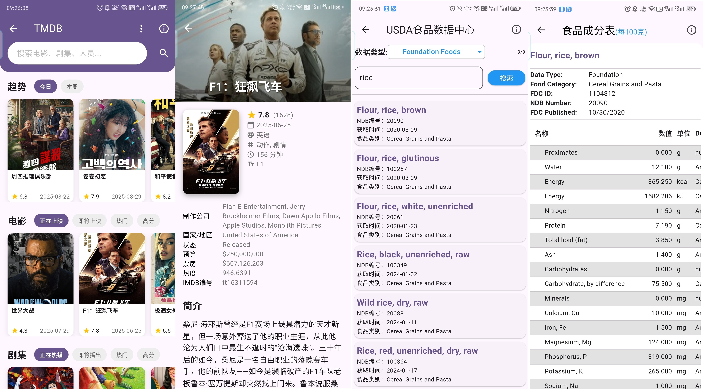
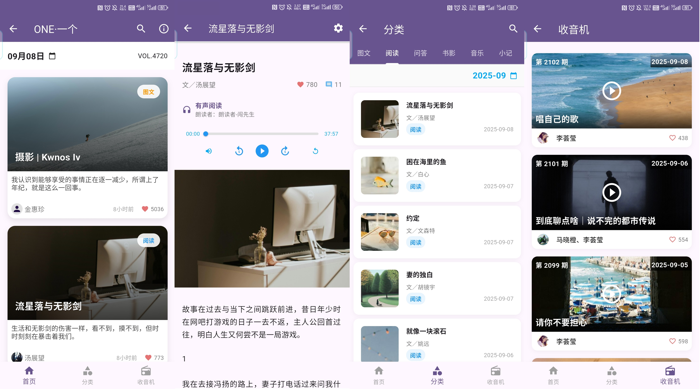

<p align="right">
  <a href="README.md">简体中文</a> |
  <a href="README-EN.md">English</a>
</p>

# SuChat Lite

(后续应该是 SuChat Life 了)

SuChat 是一个以简洁 AI 聊天为核心，并集成多种生活娱乐工具的跨平台应用，由 Flutter 开发并通过云端大模型 API 驱动：

- AI 聊天支持简单自定义角色；
- 一些其他 AI 功能，例如支持简单的音频、图片、视频资源生成，录音文件识别，快速翻译；
- 一些有少量使用 AI 特性的扩展功能，如训练助手、饮食日记、极简记账、记事本；
- 集成了很多基于官方、开源、第三方的 API 构建的生活娱乐功能：
  - 各种新闻热榜，杂文趣图；
  - 使用官方(或开源)提供的 API 构建的服务：
    - [Bangumi](https://github.com/bangumi/api)、[MyALimeList](https://docs.api.jikan.moe/)、[TMDB](https://developer.themoviedb.org/reference/intro/getting-started)、[USDA 食品数据中心](https://fdc.nal.usda.gov/api-guide/) 等；
  - 使用第三方提供的 API 构建的服务：
    - 豆果美食、岛读 APP、`ONE·一个` APP
    - 好看漫画(默认未启用，需要自行取消注释后编译)

桌面主页面预览:



移动端截图:



---

更多更新内容可查看 [CHANGELOG](CHANGELOG.md) 文件，不再此页面赘述。

## AI 对话

- **支持多个 LLM 提供商**
  - 支持多个云平台在线模型 HTTP API 的调用
  - 未预设的云平台可以单个手动填写：请求地址、模型名、API Key 即可使用
- **本地数据存储**
  - 所有对话保留在设备本地(但不同的平台记录各自独立)
  - 桌面端在`/文档/SuChatFiles`，移动端在`/设备根目录/SuChatFiles`
- **Markdown, Latex & 代码高亮**
  - 简单的 Markdown, Latex 语法支持和代码高亮的支持
- **更丰富的消息处理**
  - 支持编辑和删除用户已发送的消息(分支管理)以及其他对消息的操作
    - 功能按钮通过选中消息长按(移动端)或者鼠标右键(桌面端)触发
  - 支持调整对话消息显示的文字大小
  - 支持自定义用户输入、大模型思考、大模型正常响应的消息文本字体颜色
  - 支持切换聊天页面的背景图片和侧边栏背景色
  - 支持使用紧凑的消息列表(选中“简洁显示”，则不显示头像和消息下方工具按钮)
- **跨平台可用性**
  - 页面适配桌面端和移动端，Windows、Linux、Android App 有编译测试
  - 无需部署，通过可下载的安装包快速开始使用，无需复杂设置
- **简单自定义角色的角色扮演**
  - 支持简单的自定义角色管理、使用自定义角色进行聊天
  - 如果是角色聊天，还可以针对特定角色设置使用自己喜欢的聊天背景图
  - 如果是角色聊天，默认会固定在左下角显示当前角色头像，可以点击放大预览并进行拖动和缩放
- **更多**
  - 大模型响应使用流式追加显示
  - 支持针对不同模型配置更多高级请求参数(慎用)
  - 支持数据的导入导出(对话数据、角色数据、模型规格数据等)
    - 可以单个类别导入导出备份，也可以整体打包备份
  - 手机 App 端支持语音转文字输入(使用的讯飞语音听写 API)

---

## 更多功能

除了核心的 AI 对话聊天部分，还添加了许多其他类型大模型使用的功能，以及之前 [Sanotsu/swmate](https://github.com/Sanotsu/swmate) 中的生活娱乐相关功能。

**_"更多功能"的模块在移动端效果较好，桌面端没有适配，甚至部分功能有可能无法按预期使用。_**

下方应用截图为开发时截取，实际完成效果可能有出入，以实际所见为准。

### 1 “更多功能”入口



- 历史记录侧边栏点击“更多功能”按钮进入
- 对话页面如果没有内容长按欢迎词、有对话内容滚动到顶部后继续下拉悬停 1.2 秒后进入

注意，大部分 AI 相关功能需要使用云端大模型 API，虽然我内置了一小部分免费模型，但我所有开源项目同一个云平台都是同一个 AK，所以限制比较多。

**最好使用自己的云平台 API Key**。直接的平台和导入方法参考下面章节。

### 2 大模型相关功能列表

**AI 语音合成、图片生成、视频生成、录音文件识别、快速翻译**:



- AI 生成语音、图片、视频结构比较类似，支持的模型要自行导入。
- 录音文件识别使用阿里云的模型，录音或者选择文件需要上传到云端去。我这里支持添加到 github 仓库当作云端存储，所以需要自行添加自己的 github 用户名、仓库名和访问令牌；否则只能输入可访问的云端音频地址进行识别。
- 快速翻译也是使用阿里云的 paraformer-realtime-v2、qwen-mt、qwen-tts 模型，所以需要自己的阿里云百炼平台 API Key。

### 3 扩展功能

**训练助手、饮食日记**:



- 训练助手是调用大模型按照预定 json 格式生成训练计划，然后可以选择某个计划进行简单跟练。
- 饮食记录可以记录自己的一日三餐。
  - 食品数据可以自己一个个添加，可以拍照通过视觉大模型识别增加添加体验。
  - 也支持 [Sanotsu/china-food-composition-data](https://github.com/Sanotsu/china-food-composition-data) 中食品营养素 json 文件的导入

**极简记账、记事本**:



- 极简记账就是自己记录支出和收入，还有按周、月、年、自定义时间段的统计图表
- 记事本就是一个富文本编辑器，可以简单记录一些内容

### 4 生活娱乐

这部分都是调用官方或者第三方 API 实现的功能，可能就和 AI 没什么关系了，但娱乐也是生活重要一部分。

**新闻热榜、趣文趣图**:



- 新闻热榜、趣文趣图等我没有自己维护爬虫后台，所以都是使用别人的 API 或者在指定网站的控制台看到的接口，所以随时可能不可用

**动漫资讯、waifu 图片**


- Bangumi、MyAnimeList、waifu 几个平台有官方或在开源的第三方 API，这是基于此增加的少量页面

**TMDB、USDA FDC 数据**



- TMDB 是一个国外的社区维护构建的电影、影视剧、演员等信息的数据库，有官方的 API。
- USDA FDC 是美国农业部食品数据中心的数据，算是美国政府机构提供的可访问数据 API。

**豆果美食、岛读**


- 豆果美食、岛读等蓝绿色图表的功能模块，都是基于同一个供交流学习的平台`https://apis.netstart.cn/` API 的，所以随时可能不可用
- 豆果美食是用户上传分享的美食食谱社区
- 岛读官方每天有推一篇文章供读者阅读交流



- `ONE·一个` APP 是一个韩寒自任主编推出的电子读物

## 云端大模型 API 说明

大模型 API 调用**只保留其 HTTP API 兼容 openAI API 结构的**云平台和对话模型。

具体如下(2025-05-27)：

- **对话模型**
  - [阿里](https://help.aliyun.com/zh/model-studio/developer-reference/compatibility-of-openai-with-dashscope)
  - [百度](https://cloud.baidu.com/doc/WENXINWORKSHOP/s/Fm2vrveyu)
  - [腾讯](https://console.cloud.tencent.com/hunyuan/start)
  - [智谱](https://open.bigmodel.cn/dev/api/normal-model/glm-4)
  - [深度求索(DeepSeek)](https://api-docs.deepseek.com/zh-cn/)
  - [火山引擎(火山方舟)](https://www.volcengine.com/docs/82379/1330310)
  - [零一万物](https://platform.lingyiwanwu.com/docs/api-reference)
  - [无问芯穹](https://docs.infini-ai.com/gen-studio/api/maas.html#/operations/chatCompletions)
  - [硅基流动](https://docs.siliconflow.cn/cn/api-reference/chat-completions/chat-completions)
- 其他兼容 openAI API 结构的云平台和 HTTP API，可使用自定义模式添加
  - 此时需要模型管理中平台选择自定义后，添加其请求地址、模型代号、平台密钥

具体使用的云平台和大模型 API 如下：

- **图片生成**
  - 阿里云: [图像生成-通义万相 文生图 V2 版](https://help.aliyun.com/zh/model-studio/developer-reference/text-to-image-v2-api-reference)、[文生图 FLUX](https://help.aliyun.com/zh/model-studio/developer-reference/flux/)
  - 智谱 AI: [CogView](https://open.bigmodel.cn/dev/api/image-model/cogview)
  - 硅基流动: [创建图片生成请求](https://docs.siliconflow.cn/cn/api-reference/images/images-generations)
- **视频生成**
  - 阿里云: [视频生成-通义万相](https://help.aliyun.com/zh/model-studio/developer-reference/video-generation-wanx/)
  - 智谱 AI: [CogVideoX](https://open.bigmodel.cn/dev/api/videomodel/cogvideox)
  - 硅基流动: [创建视频生成请求](https://docs.siliconflow.cn/cn/api-reference/videos/videos_submit)
- **语音合成** （仅阿里云，可自行选择模型）
  - [语音合成-CosyVoice](https://help.aliyun.com/zh/model-studio/cosyvoice-websocket-api)
  - [语音合成-Sambert](https://help.aliyun.com/zh/model-studio/sambert-websocket-api)
  - [通义千问-TTS](https://help.aliyun.com/zh/model-studio/qwen-tts)
- **语音合成** （仅阿里云，内置无法自定义）
  - [Paraformer-录音文件识别](https://help.aliyun.com/zh/model-studio/paraformer-recorded-speech-recognition-restful-api)
  - [SenseVoice-录音语音识别](https://help.aliyun.com/zh/model-studio/developer-reference/sensevoice-recorded-speech-recognition-restful-api)

目前只调试了 Android 手机端、Linux 桌面端、Windows 桌面端:

- Ubuntu 22.04 (Inter Core i5-4460 的 Windows 7 下使用 VirtualBox 安装的虚拟机)
- Android 14 & Android 12 (努比亚 Z60 Ultra 和 小米 6)
- Windows 11 (机械革命 耀世 16 Pro)

---

## 使用指南

从 [Releases](https://github.com/Sanotsu/SuChat-Lite/releases) 直接下载对应平台应用即可，桌面端是封装过的，应该无需安装。

### Changelog

更多更新内容可查看 [CHANGELOG](CHANGELOG.md) 文件。

### 补充说明

打包好的应用是直接使用我个人密钥的一些免费的大模型，都是比较基础的。

可以自行导入或添加平台模型和密钥使用自己的资源。

- 模型和密钥管理入口：点击在侧边栏的“模块”按钮，进入“配置页面”页面。
- 如果想使用本应用预设支持的平台中更加强劲的模型，可自行去各个平台充值、获取密钥。
- 可以手动添加模型和平台密钥，或者导入符合预设结构的入密钥和模型 json 文件
  - **密钥仅使用 `get_storage` 缓存在本地。除了调用 API 都不联网。**
  - 想用哪个平台、哪个模型，全都自己导入
- json 导入时，平台密钥和模型规格的**固定 json 结构**见下方

---

<details>

<summary>导入平台密钥和模型规格 json 文件规格</summary>

**_注意，平台密钥和平台模型规格要同时导入，否则无法正常使用。_**

#### 平台密钥 json 结构

导入预设平台的密钥的 key 一定要和这个文件中 key 一样，不然匹配不上：

```json
{
  "USER_ALIYUN_API_KEY": "sk-xxx",
  "USER_BAIDU_API_KEY_V2": "xxx",
  "USER_TENCENT_API_KEY": "xxx",

  "USER_DEEPSEEK_API_KEY": "sk-xxx",
  "USER_LINGYIWANWU_API_KEY": "xxx",
  "USER_ZHIPU_API_KEY": "xxx",

  "USER_SILICONCLOUD_API_KEY": "sk-xxx",
  "USER_INFINI_GEN_STUDIO_API_KEY": "sk-xxx",

  // 火山方舟的预置推理接入点
  "USER_VOLCENGINE_API_KEY": "xxx",
  // 火山方舟自定义推理接入点(比较简单的联网应用)
  "USER_VOLCESBOT_API_KEY": "xxx",

  // 讯飞, 语音转写需要
  "USER_XFYUN_APP_ID": "xxx",
  "USER_XFYUN_API_KEY": "xxx",
  "USER_XFYUN_API_SECRET": "xxx"
}
```

- 密钥可以不是所有平台都填，但填写的部分 key 一定要完全一致，否则识别不到就算有导入模型也用不了
- 讯飞那几个是语音转写需要。

#### 大模型规格 json 结构

简化必要栏位只需要**平台、模型名、模型类型**即可。

```json
[
  {
    "platform": "<*代码中自定义的平台代号，枚举值>",
    "model": "<*指定平台中使用的模型代号，必须与API文档中一致，会用于构建http请求>",
    "modelType": "<*代码中自定义的模型类型代号，枚举值>"
  },
  {
    "platform": "aliyun",
    "model": "deepseek-r1",
    "modelType": "reasoner"
  },
  {
    "platform": "aliyun",
    "model": "deepseek-v3",
    "modelType": "cc"
  }
  // ……
]
```

- platform 枚举值:

```ts
enum ApiPlatform {
  // 用户使用的模型不属于预设平台(比如谷歌等)
  // 那么就是统一custom，并在自定义模型中直接新增url、apikey等栏位去取用
  // 这个不是默认的有效平台，不需要用户导入密钥啥的
  custom,

  aliyun, // 阿里云百炼
  baidu, // 百度千帆
  tencent, // 腾讯混元

  deepseek, // 深度求索
  lingyiwanwu, // 零一万物
  zhipu, // 智谱 AI

  siliconCloud, // 硅基流动
  infini, // 无问芯穹的 genStudio

  // 2025-03-24 火山引擎默认调用和关联应用(比如配置了联网搜索)使用的url不一样
  // 避免出现冲突，分成两个且互不包含
  volcengine,
  volcesBot,
}
```

- modelType 枚举值:

```ts
enum LLModelType {
  cc, // 文本对话
  reasoner, // 深度思考
  vision, // 图片解读
  vision_reasoner, // 视觉推理
}
```

后续我会放一些整理好的各个平台我常用的大模型规格 json 文件在项目的 **[\_cus_model_jsons](./_cus_model_jsons)** 文件夹中，可以参考使用。

</details>

---

<details>

<summary>导入极简记账 json 文件规格</summary>

```json
[
  // {
  //   "date": "<日期>",
  //   "category": "<账单分类，可到‘添加账单’页面查看>",
  //   "item": "<账单内容>",
  //   "item_type": <收支，0收入，1支出>,
  //   "value": <具体数值>
  // },
  {
    "date": "2018-03-20",
    "category": "餐饮",
    "item": "中午外卖鱼香肉丝",
    "item_type": 1,
    "value": 18.0
  },
  {
    "date": "2018-03-20",
    "category": "工资",
    "item": "3月份工资",
    "item_type": 0,
    "value": 2500.0
  }
]
```

</details>

---

<details>

<summary>导入食品营养素 json 文件规格</summary>

- 饮食日记支持自定义食品 json 文件导入，可参考我之前将《中国食物成分表标准版(第 6 版)》中“能量和食物一般营养成分”部分的表格截图转换为特定格式的测试 json 文件 [Sanotsu/china-food-composition-data](https://github.com/Sanotsu/china-food-composition-data)。
- 注意，该仓库食品营养素 json 文件可以正常导入，但无法保证该 OCR 结果正确。

</details>

---

## 开发环境

在一个 Windows 7 中使用 Visual Box 7 安装的 Ubuntu22.04 LTS 虚拟机中进行开发。

```sh
# 开发机环境：
$ lsb_release -c -a && uname -r -m
No LSB modules are available.
Distributor ID: Ubuntu
Description:    Ubuntu 22.04.3 LTS
Release:        22.04
Codename:       jammy
5.15.0-119-generic x86_64

# 2025-06-23 使用的 flutter 版本：
$ flutter --version
Flutter 3.32.4 • channel stable • https://github.com/flutter/flutter.git
Framework • revision 6fba2447e9 (10 天前) • 2025-06-12 19:03:56 -0700
Engine • revision 8cd19e509d (10 天前) • 2025-06-12 16:30:12 -0700
Tools • Dart 3.8.1 • DevTools 2.45.1
```

## 贡献指南

欢迎提交 Issues 和 Pull Requests 来帮助改进项目。
